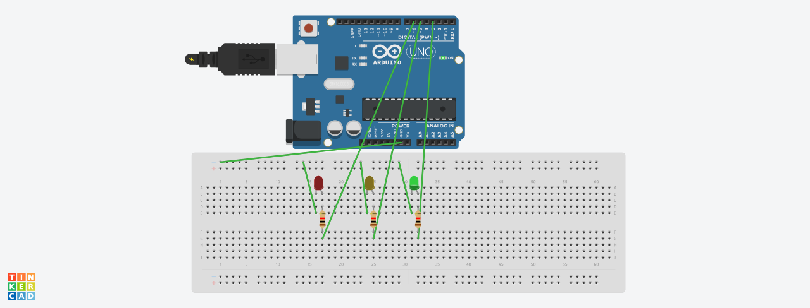

🚦 Arduino Traffic Light System (3 LEDs)
📌 Project Overview

This project simulates a basic traffic light system using an Arduino Uno and three LEDs:

🔴 Red LED

🟡 Yellow LED

🟢 Green LED

The LEDs turn ON and OFF in a fixed sequence, similar to real-world traffic signals.

🧰 Components Used

Arduino Uno

Red LED

Yellow LED

Green LED

3 × 1kΩ Resistors

Breadboard

Jumper Wires

🔌 Pin Connections
LED Color	Arduino Pin	Resistor
Red	Pin 6	1kΩ
Yellow	Pin 5	1kΩ
Green	Pin 3	1kΩ

👉 Note:

Long leg (Anode) of LED → Resistor → Arduino Pin

Short leg (Cathode) → GND

⚙️ Working Principle

Red LED ON → Stop

Yellow LED ON → Get Ready

Green LED ON → Go

The sequence repeats continuously using delay timing.

🧠 Logic Flow
Red ON → Delay → OFF
Yellow ON → Delay → OFF
Green ON → Delay → OFF
Repeat

🖥️ Software Required

Arduino IDE

(Optional) Proteus / Tinkercad for simulation

📁 Project Structure
Arduino-Traffic-Light/
│── Project2.ino
│── traffic_light.png
│── README.md

▶️ How to Run

1. Connect the circuit as per pin table

2. Open traffic_light.ino in Arduino IDE

3. Select Board: Arduino Uno

4. Select correct COM Port

5. Click Upload

🧪 Simulation

This project can be tested using:

1. Proteus

2. Tinkercad Circuits

📸 Circuit Diagram

🚀 Future Improvements

Add pedestrian button

Use timer interrupt instead of delay()

Convert to 4-way traffic junction

👨‍💻 Author

Pranay Thakur
B.Tech ECE Student

⭐ Support

If you find this project helpful, give it a ⭐ on GitHub!
